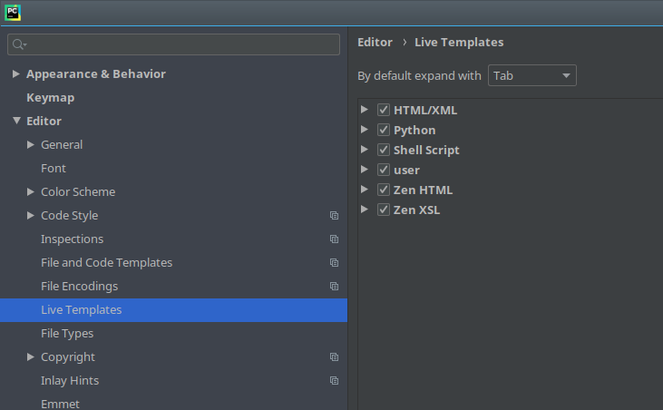

Сеттеры и геттеры

1) раньше все было просто у класса были переменные

 
2) потом подумали что если изменяется некоторая переменная класса, то может изменится и другая.  Например если в машине количество мест превышает 6, то это не частная машина, а общественный транспорт, и чтобы минимизировать количество написанного кода сложили это все в класс и назвали  сеттеры и геттеры

 

3) потом подумали что каждый раз писать

 

вместо

 

как-то напряжно и придумали properties

 

теперь можно писать так

 

4) вот они все напридумывали, а нам теперь на каждую переменную  писать лишних 8 строк осмысленного кода.  Дабы сократить бессмысленный вод текста придумали code snippet

идем в file → settings →live templates

 

в ветке Python создаем

 

заполняем

 

и в поле ввода пишем это

>_$var_name$ = None
>
>def set_$var_name$(self,$var_name$):
>    self._$var_name$ = $var_name$
>
>def get_$var_name$(self):
>    return self._$var_name$
>
>def del_$var_name$(self):
>    del self._$var_name$
>
>$var_name$ = property(get_$var_name$, set_$var_name$, del_$var_name$, "I'm the '$var_name$' property.")

 

указываем где наш сниппет может вызываться

 

в итоге мы можем делать следующее

 

в итоге вернулись к началу, просто внутри  может происходить что-то особенное.  В 99% случаев там не будет ничего особенного кроме присвоения переменных,  [просто здесь так принято](https://onedio.ru/news/zanimatelnaya-sociologiya-5-obezyan-lestnicy-i-banany-12717) и в вас будут тыкать пальцами если вы будете делать по другому.
